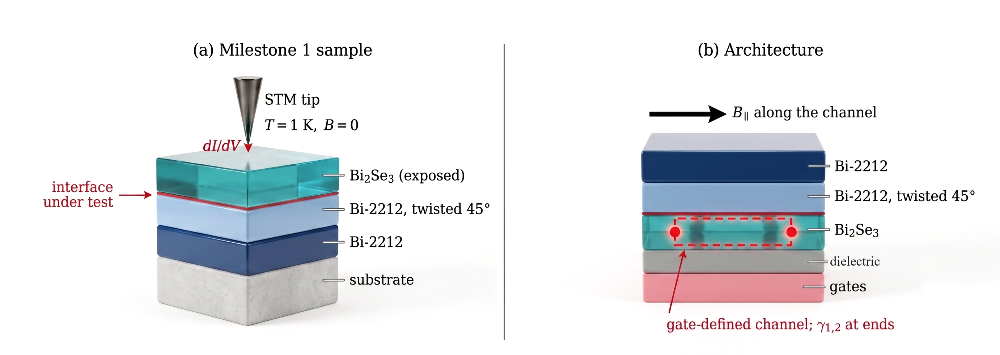
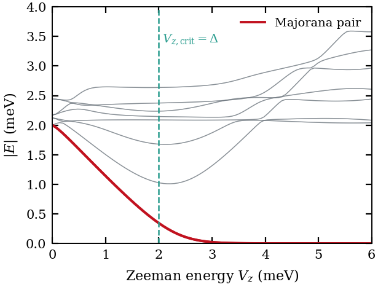
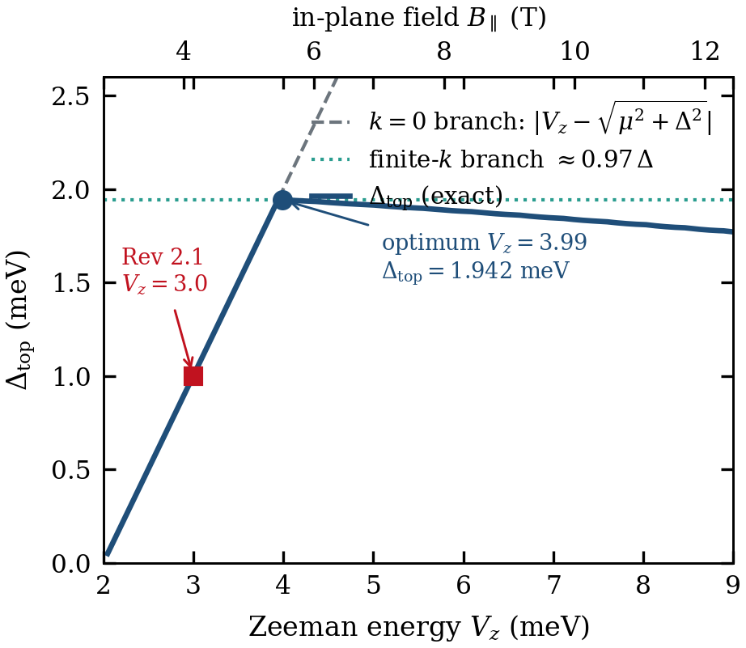
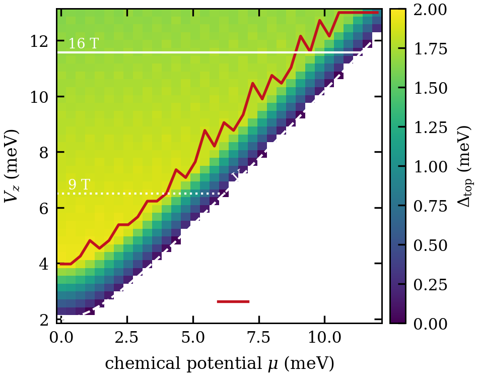
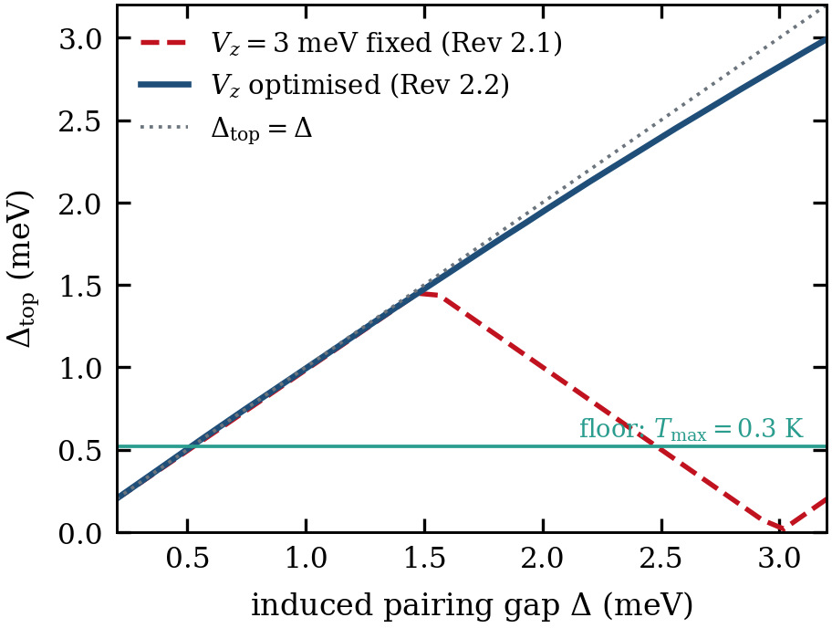
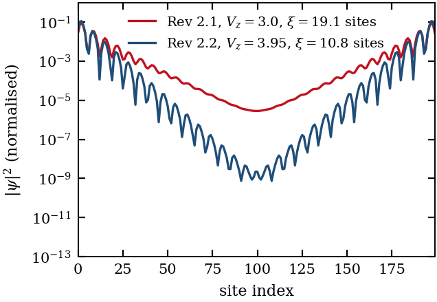
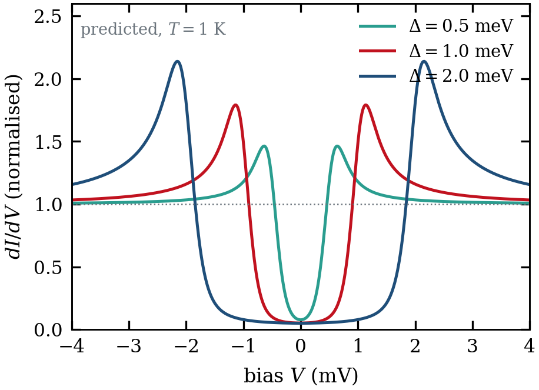

# Twisted-Cuprate-Majorana

**A validated simulation stack for a 0.3 K topological qubit architecture on a
twisted-cuprate / topological-insulator heterostructure.**

This repository contains the Bogoliubov–de Gennes and phonon-transport solvers
behind a design study for a Majorana processor operating at 0.3 K on a fully
dry cryogenic chain — no dilution refrigerator, no liquid cryogens.

> **This is a classical simulator.** It runs float64 linear algebra on CPUs and
> GPUs. It is not a quantum processor and does not emulate one.
>
> **No device has been built.** Every result here is conditional on an assumed
> proximity-induced pairing gap Δ that has never been measured in this material
> system. See [Limitations](#limitations).
>
> **The platform is not novel to this work.** Twisted-cuprate Majorana
> proposals are established literature. The contribution is the operating-point
> analysis, the gate-defined-channel variant, and the engineering budgets.

The full technical write-up is [`paper/main.tex`](paper/main.tex) (REVTeX,
6 pages, compiles on Overleaf with pdfLaTeX).

---

## The geometry



*Cross-section. **(a)** The Milestone 1 sample: bilayer down first, Bi₂Se₃ on
top, so the proximitised surface is exposed to a tunnelling probe. No gating,
no channel, no field, because the measurement only asks whether the interface
induces a gap. **(b)** The architecture: the channel is gate-defined in the
Bi₂Se₃, which therefore sits beneath the bilayer, with B∥ along the channel
and Majorana modes at its ends. These are deliberately different samples —
same interface under test, different stacking order, because (b) must be gated
and (a) must be probed. The 45° twist is an in-plane rotation and is not
visible in cross-section.*

---

## The central result

The channel enters the topological phase when the Zeeman energy exceeds
V_z,crit = √(µ²+Δ²), which is just Δ at the µ = 0 sweet spot. Above it, the
bulk gap closes and reopens, and a Majorana pair pins exponentially to zero
energy.



*BdG spectrum of an N = 80 chain at µ = 0, t = 20 meV, α = 10 meV, Δ = 2 meV.
The bulk gap closes at V_z,crit = Δ = 2 meV (green dashed) and the Majorana
pair (red) pins to zero beyond it. Grey: bulk states.*

That transition is necessary but not sufficient — what governs protection is
not V_z,crit but Δ_top, the lowest bulk excitation at the operating point. Two
minima compete for it: a **k = 0 branch** at |V_z − √(µ²+Δ²)| that rises with
the Zeeman energy, and a **finite-k branch** near 0.97Δ that does not. The
operational gap is the smaller of the two, so

> **Δ_top ≤ Δ, with equality approached at V_z ≈ 2Δ**



*The k = 0 branch (grey dashed) grows without bound; the finite-k branch (green
dotted) caps it. The exact gap (blue) peaks at V_z = 3.95 meV. The red square
is V_z = 3 meV — a natural-looking choice that sits on the rising branch and
gives only half the available gap.*

Choosing V_z = 1.5Δ yields Δ_top = Δ/2. Moving to V_z ≈ 2Δ **nearly doubles
the operational gap at fixed material parameters**:

| | V_z = 3.00 meV | V_z = 3.95 meV |
|---|---|---|
| In-plane field B∥ | 4.15 T | 5.46 T |
| **Δ_top** | 1.000 meV | **1.944 meV** |
| T_max = Δ_top/20k_B | 0.58 K | **1.13 K** |
| Localisation length ξ | 19.1 sites | **10.8 sites** |
| Channel length L = 30ξ | 5.73 µm | **3.24 µm** |
| Field alignment | 0.0276° | 0.0210° |

Two things get *harder*: the field rises by 1.3 T, and the alignment tolerance
tightens correspondingly.

---

## The operating region

V_z is set by the in-plane field, so a laboratory magnet ceiling binds the
optimisation. This constraint is not optional: because the k = 0 expression
grows monotonically, an unconstrained search that evaluates only the closed
form will report the edge of its own scan range as an optimum.



*Δ_top over the (µ, V_z) plane. White dashed: the phase boundary. Red: the
optimum locus, tracking V_z ≈ 2V_z,crit. White horizontal lines: 9 T and 16 T
ceilings at g = 25.*

Between µ = 0 and µ = 8 meV the optimised gap falls only 8%. The chemical
potential is genuinely free over that range — what limits it is **magnet
access**, not materials.

---

## Robustness, and a retracted result



*Red dashed: V_z held fixed, showing a spurious peak near Δ = 1.5 meV. Blue:
V_z re-optimised at each Δ — monotonic, approaching the bound Δ_top = Δ.*

An earlier version of this work reported Δ_top as a *tent function* of Δ,
peaking at 1.51 meV, and concluded the design point sat on a falling edge.
**That non-monotonicity was an artifact of holding V_z fixed** — it is not a
property of the model, and it is retracted. With V_z re-optimised the
dependence is monotonic.

The consequence that matters: **the architecture tolerates half the induced
pairing for the same performance.** Δ = 1 meV now gives Δ_top = 1.00 meV and
T_max = 0.58 K, where under the old operating point it sat marginally at
0.29 K.

---

## What the code does

| Module | Package | What it computes |
|---|---|---|
| 1 | `tvqpu.lattice` | 4N×4N BdG Hamiltonian, exact diagonalisation; Jordan–Wigner MPO |
| 2 | `tvqpu.dmrg` | DMRG beyond mean field, with multi-restart for disordered chains |
| 3 | `tvqpu.kernels` | Fused two-site update (reference path verified; **Triton path awaits a CUDA runner**) |
| 4 | `tvqpu.substrate` | Ballistic phonon focusing — crystallographic symmetry and the directional-DOS Jacobian |
| — | `tvqpu.budget` | Area-law memory budgeting; refuses a run before it OOMs |

### Validation

Everything is checked against a known answer before it is trusted:

```bash
python -m tvqpu.lattice --validate
```

17 checks, including the analytic critical field V_z,crit = √(µ²+Δ²),
particle–hole symmetry of the class-D Hamiltonian, the MPO against an
independently built dense Hamiltonian in both storage forms, and the
transverse-field Ising ground energy against the exact free-fermion solution.

Selected results reproduced by this stack:

- Majorana hybridisation splitting **57.0 neV** at N = 200
- DMRG vs exact diagonalisation to **2×10⁻¹¹**, interactions included
- MPO cross-check against an independently written quimb construction to **10⁻¹⁰**
- Phonon-focusing solver **exact (1.000000)** on the isotropic case, and it
  reproduces the 80 K principal/minor ray structure of
  [Li *et al.*, Nat. Phys. (2026)](https://doi.org/10.1038/s41567-026-03335-y)



*Site-resolved Majorana density at both operating points. Optimising V_z
shortens ξ from 19.1 to 10.8 sites, because ξ ∝ 1/Δ_top.*

---

## Install and test

```bash
pip install -e ".[dev]"
pytest
```

Optional extras: `tn` (quimb, for DMRG), `gpu` (torch + Triton), `substrate`
(phonopy/phono3py). GPU tests skip without CUDA — **a skipped test is not a
passing test**, and the fused kernel is not considered verified until CI
includes a CUDA runner.

Long-running validation:

```bash
pytest -m slow
```

### Reproducing the figures

```bash
python paper/make_figures.py
```

Every figure except the device schematic is computed from `tvqpu.lattice` —
the same model the test suite validates. The schematic is a drawing of the
geometry and is labelled as such; it is the only illustrative figure.

### Other entry points

```bash
python -m tvqpu.lattice --gap --n-sites 200      # operating point
python -m tvqpu.lattice --sweep-delta            # gap vs pairing
python scripts/robustness_map.py --b-max 16      # (mu, V_z) map under a field cap
```

---

## The decisive measurement

Every result here is conditional on Δ, and Δ **cannot be computed** — cuprate
superconductivity has no accepted microscopic theory, so the pairing in the
parent material, and what it induces across an interface, is not obtainable
from first principles.

The experiment is tunneling spectroscopy into the proximitised TI surface at
zero field: no gating, no channel definition, no device fabrication.



*Predicted conductance at T = 1 K, Dynes-broadened. The observable is a hard
gap — zero-bias conductance suppressed to a few percent of normal.*

Tunneling resolution is ≈3.5 k_BT, so a 2 meV gap is comfortably resolved at
**1 K** and marginally at 4.2 K. **A dilution refrigerator is not required.**

| Measured Δ | Δ_top | T_max | Verdict |
|---|---|---|---|
| < 0.50 meV | < 0.52 | < 0.30 K | architecture fails |
| 1.00 meV | 1.002 | 0.58 K | viable |
| 2.00 meV | 1.944 | 1.13 K | design point |
| 3.00 meV | 2.825 | 1.64 K | comfortable |

**The literature is contested.** ARPES on Bi₂Se₃ grown *in situ* on Bi-2212
found no induced gap; a later STM study attributed an apparent gap in the same
system to Coulomb blockade; conversely, proximity-induced superconductivity to
at least 80 K has been reported for *mechanically bonded* Bi₂Se₃/Bi-2212. The
pattern is that growth-based interfaces fail while bonded ones succeed.
Critically, the symmetry objection applies to a *single* d-wave layer — the
45° twist converts the pairing to fully gapped d+id′, and **that configuration
has not been tested.**

---

## Limitations

1. **The induced gap is unmeasured.** Every protection budget scales
   exponentially with it. This is the load-bearing assumption.
2. **Quantitative precision is not claimed.** Cuprates are complex oxides whose
   interfacial physics is not quantitatively understood. Theory in these
   systems is generally trustworthy as to how quantities *scale* and to within
   an order of magnitude — not to a significant figure. Every number here is
   reported as computed from the stated model at the stated parameters, and
   should be read as a scale estimate rather than a prediction.
3. **Not room temperature.** At 300 K the criterion demands Δ_top ≈ 517 meV —
   a bare pairing of order 1 eV, more than an order of magnitude beyond any
   known superconductor. No thermal engineering alters k_BT.
4. **The Triton kernel is unverified.** No CUDA runner has executed it.
5. **The disorder threshold is a bound**, not a converged value:
   δµ_rms/Δ_top ≈ 0.9 ± 0.15, non-monotonic in 1/L at the sampling used.
6. **Peak phonon-focusing magnitude is a regression pin**, not validation —
   it is this solver's own output. The Northrop & Wolfe Si/Ge check is unrun.
7. **Per-flake assembly** is low-throughput laboratory work, incompatible with
   wafer-scale throughput until a c-axis-coherent thin-film twist process
   exists. That is a yield limitation, not a physics one.

Full detail in [`docs/ARCHITECTURE.md`](docs/ARCHITECTURE.md), which maintains
an explicit ledger of what is validated versus what is asserted.

---

## References

- A. Y. Kitaev, *Phys.-Usp.* **44**, 131 (2001)
- L. Fu and C. L. Kane, *Phys. Rev. Lett.* **100**, 096407 (2008)
- Y. Oreg, G. Refael, F. von Oppen, *Phys. Rev. Lett.* **105**, 177002 (2010)
- O. Can *et al.*, *Nat. Phys.* **17**, 519 (2021)
- S. Y. F. Zhao *et al.*, *Science* **382**, 1422 (2023)
- G. Margalit, B. Yan, M. Franz, Y. Oreg, *Phys. Rev. B* **106**, 205424 (2022)
- T. Karzig *et al.*, *Phys. Rev. B* **95**, 235305 (2017)
- M. Li *et al.*, *Nat. Phys.* (2026), [doi:10.1038/s41567-026-03335-y](https://doi.org/10.1038/s41567-026-03335-y)

Full bibliography in [`paper/main.tex`](paper/main.tex).

---

## Licence

[Apache License 2.0](LICENSE). Copyright 2026 Justin Grady.

This covers the code, the documentation and the figures. Note that Apache 2.0
includes an explicit patent grant (§3): contributors grant users a licence
under any patent claims necessarily infringed by their contribution.

## Citing

If this is useful, cite the manuscript in `paper/`. The physical platform is
prior work — see the references above and the bibliography in
[`paper/main.tex`](paper/main.tex) — and should be cited directly rather than
through this repository.
